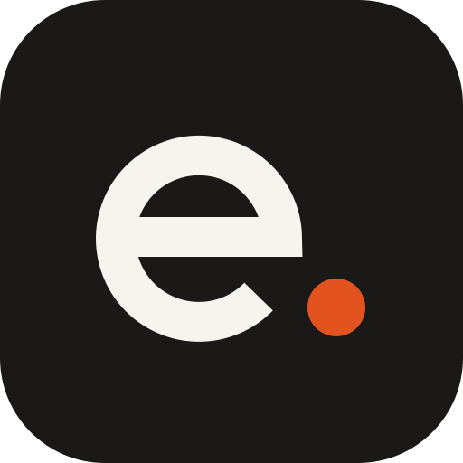
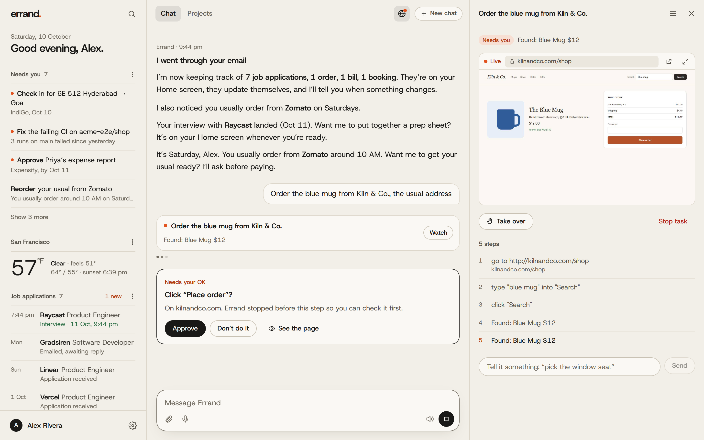
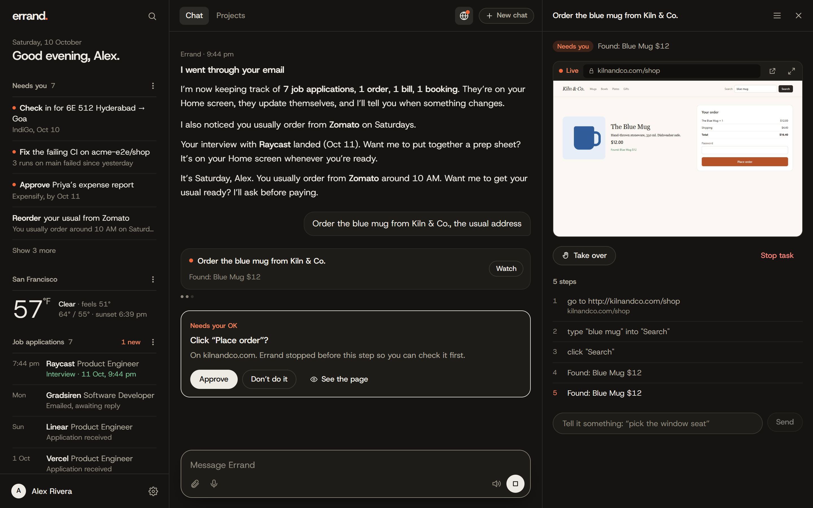
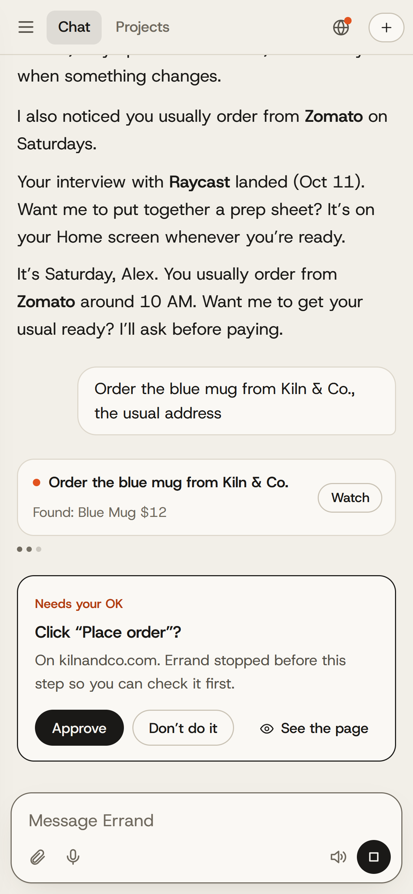

<div align="center">



# Errand

**The free, open-source Hark.** A personal AI agent that notices what needs doing, and does it.

[](https://github.com/FurquanEats/errand/actions/workflows/ci.yml) [](https://github.com/FurquanEats/errand/releases/latest) [](LICENSE)

</div>



Errand reads your email the way a good assistant would. It spots the CI run that has been failing since yesterday, the order you place most Fridays, the bill due this week and the flight you still need to check in for. It keeps your job applications, orders, bills and trips up to date by itself and tells you when something changes. Ask in one chat and it does the job on real websites, where you can watch it live, take over with your own mouse, and approve anything before it pays or sends.

It runs on your computer and uses the AI you already have: your **ChatGPT plan**, **OpenRouter**, **any API key** or a **local model**. No subscription, no usage caps from us, and your data stays with you.

## What it does

**It notices things without being asked.** Every 15 minutes Errand reads new mail and turns what matters into one-tap actions:

- “Fix the failing CI on acme/shop: 3 runs on main failed since yesterday.” Tap it and Errand opens the run, reads the log and explains the fix.
- “It’s Friday, Alex. Want your usual from Zomato?” It learns habits from card, UPI and receipt emails, and always asks before paying.
- “Pay the Airtel bill, due Oct 12”, “Check in for 6E 512”, “Book a place to stay in Goa”, “Approve Priya’s expense report”, “Check the new sign-in to your Google account”.

**It keeps track for you.** Job applications (including the ones you emailed yourself), orders and deliveries, bills and renewals, and trips build themselves from your email. When Raycast moves you to the interview stage, you hear about it, and Errand offers a prep sheet. Ask “how are my applications going?” or “how much did I spend on food this month?”.

**It works real websites.** The browser agent signs in, searches, compares, fills forms, uploads your CV and checks out. Watch it live in Errand. Take over whenever you like, to sign in, solve a check or pick a seat, with your own mouse and keyboard, then hand it back and it carries on from where you left it. It stops before anything irreversible (paying, booking, sending, deleting) and waits for your OK. Verification codes are found in your inbox; new accounts get a strong password saved to your encrypted vault. Several tasks run at once.

**One chat for everything.** “Clean up my inbox.” “Find remote roles that fit my CV and apply to the best three.” “Brief me every morning at 8.” “I moved to Denver.” “Use Gemini instead.” Errand also has:

- **Panels**: describe a live mini-app (“my Strava week”, “BTC price”, “this week’s meetings”) and it appears on your Today column, refreshing itself.
- **Scheduled tasks**: “sweep job alerts every 3 hours”, “next Friday at 9, buy the gift card”.
- **Projects** for long goals like a job search or a move, with tasks, notes and your own documents.
- **Memory** you can read, edit and delete.
- **Presentations, files and charts** made from your data, and receipts, tickets and QR codes brought back from websites.
- **Integrations**: Google (Gmail, Calendar, Drive) for any number of accounts, Outlook through Microsoft sign-in, any IMAP mailbox, calendar links, local folders, API keys and every **MCP** server (Slack, GitHub, Notion, Linear, Spotify, Strava, Home Assistant…).
- **Voice**: dictate, or talk hands-free.
- **Your phone**: scan a QR code and use Errand from your phone on the same Wi-Fi, or anywhere with [Tailscale](https://tailscale.com).
- **Never stuck**: connect more than one AI and Errand switches automatically when one is busy or down.

<p align="center">
  
  
</p>

## Errand and Hark

Errand does what Hark sells: one chat, a browser agent that works real websites, one-tap actions, self-updating panels and trackers, scheduled tasks, memory you can edit, projects, an encrypted vault and approvals. The difference is who it belongs to.

|                       | Errand                                                                                                         | Hark (October 2026)                 |
| --------------------- | -------------------------------------------------------------------------------------------------------------- | ----------------------------------- |
| Price                 | **Free.** You pay your AI provider at cost, or nothing with a local model                                      | Free with caps, paid plans for more |
| Usage limits          | **None from us**                                                                                               | Per plan                            |
| AI model              | **Any**: ChatGPT plan, OpenRouter, OpenAI, Anthropic, Gemini, Groq, Mistral, DeepSeek, xAI, Ollama, LM Studio… | Theirs                              |
| Where your data lives | **Your computer**, in a local database you can export or delete                                                | Their cloud                         |
| Browser agent         | Your browser, signed in as you; watch, take over and hand back from Errand. Or a cloud browser you choose      | Their cloud computers               |
| Source code           | **Open** (MIT)                                                                                                 | Closed                              |
| Integrations          | Built in, plus **any MCP server** and any API key                                                              | Their list                          |

## Install

**Windows**

1. Download **[Errand-Setup.exe](https://github.com/FurquanEats/errand/releases/latest/download/Errand-Setup.exe)** and open it.
2. If Windows says it protected your PC, choose **More info → Run anyway** (see [code signing](#code-signing-policy)).
3. Wait a minute or two. Errand opens by itself.

**Mac and Linux**

Open **Terminal** (on a Mac: <kbd>⌘</kbd> <kbd>Space</kbd>, type _Terminal_, <kbd>Return</kbd>), paste this line and press <kbd>Return</kbd>:

```bash
curl -fsSL https://raw.githubusercontent.com/FurquanEats/errand/main/scripts/install.sh | bash
```

The installer needs no admin rights and no Git. It brings its own Node.js if you don't have it and keeps everything in one folder (`%LOCALAPPDATA%\Errand` or `~/Errand`). Open Errand from its icon on your Desktop or Start menu (Applications on a Mac). It keeps working quietly in the background, so it can notice things and run your scheduled tasks; closing the window doesn't stop it. On Windows it has an icon by the clock with **Start with Windows**, **Update** and **Quit**, and shows Errand's notifications when its window is closed. The browser agent uses Chrome, Edge or Brave (Windows already has Edge).

**Update:** ask Errand _“is there an update?”_, or use **Settings → About → Update now**. Your data stays.

**Uninstall:** on Windows, **Settings → Apps → Installed apps → Errand**. It asks whether to keep your chats and settings. On a Mac or Linux, choose **Quit Errand**, then delete `~/Errand` (and `Errand.app` from Applications on a Mac).

**Privacy:** Errand sends nothing to us. [PRIVACY.md](PRIVACY.md) lists everything it sends, where, and how to switch off the few things it does on its own.

### First run

Three short steps: your name, your AI and your email.

- **Easiest AI:** _Continue with ChatGPT_ if you have a paid ChatGPT plan (Go, Plus or Pro), or _Continue with OpenRouter_.
- **Easiest email:** type your Gmail, iCloud, Yahoo, Zoho or Fastmail address and paste an _app password_; Errand shows you where to make one. Google sign-in works too ([below](#connect-google-gmail-calendar-drive)).

Then try _“What needs my attention today?”_ or _“Find me a flight to Goa next Friday under ₹6,000”_.

### Pick your AI

- **Continue with ChatGPT** uses your ChatGPT Go, Plus or Pro plan through OpenAI’s official _Sign in with ChatGPT_ for open-source apps. Usage counts toward your plan.
- **Continue with OpenRouter**: one sign-in, hundreds of models, billed to your OpenRouter credits.
- **Any API key**: OpenAI, Anthropic, Google Gemini, Groq, Mistral, DeepSeek, xAI, Together, or any OpenAI-compatible address.
- **Local and free**: [Ollama](https://ollama.com) or LM Studio.

Mix them: a strong model for chat, a vision model for the browser agent, a cheap one for background work. Anthropic and Google don’t allow their consumer subscriptions in other apps, so use an API key for their models.

### Connect Google (Gmail, Calendar, Drive)

Errand uses **your own** Google OAuth client, so your data goes from Google straight to your computer. About three minutes, once:

1. In [Google Cloud → Credentials](https://console.cloud.google.com/apis/credentials), create a project and enable the Gmail, Google Calendar and Google Drive APIs.
2. Create an **OAuth client ID** of type **Web application** with the redirect URI `http://localhost:4747/api/oauth/google/callback`.
3. Paste the client ID and secret in **Settings → Accounts**, then **Connect a Google account**. Repeat for each account.

While the Google app is in “Testing”, add your accounts as test users.

### Always on

Run Errand on a home server, a VPS or a Raspberry Pi so tasks keep running while your laptop sleeps. The Docker image brings its own Chromium:

```bash
docker compose up -d
```

Set `ERRAND_PASSWORD` and `VNC_PASSWORD` in `docker-compose.yml` first. Errand is on port 4747; port 6080 (`/vnc.html`) optionally shows the agent's whole desktop. You can also point the browser agent at a hosted browser (Browserbase, Browserless, Steel…) in **Settings → Browser agent**.

## Security

Errand can act for you, so **AI models never see your secrets** and **nothing irreversible happens without you**.

- Logins, cards and API keys are encrypted (AES-256-GCM, with a key derived from your passphrase that lives only in memory while unlocked). Models see placeholders, filled in at the moment of typing.
- A login only fills on its own website. Cards and addresses ask before they're used on a new site. API keys only go to the site they were saved for, and never follow a redirect elsewhere.
- Paying, sending, booking, deleting, creating accounts, creating email filters and running commands all need your approval, and the browser agent refuses “Place order”-style clicks you didn't approve.
- Web pages and emails are treated as untrusted. Credentials found in them are blocked before the model sees them.
- The local server rejects cross-site requests, DNS rebinding and requests to your private network. Panels and presentations run sandboxed without network access. A paired phone can't run programs, share folders or export your data.

Details and reporting: [SECURITY.md](SECURITY.md).

## Code signing policy

Windows downloads are built by [GitHub Actions](.github/workflows/release.yml) from the tagged source in this repository, and every signing request is approved by hand. Signing through the [SignPath Foundation](https://signpath.org) is being set up; until then Windows may say the publisher is unknown.

- Committers and reviewers: [Mohammed Furquan](https://github.com/FurquanEats)
- Approvers: [Mohammed Furquan](https://github.com/FurquanEats)
- Privacy: [PRIVACY.md](PRIVACY.md)

## Configuration

Everything is optional; see [`.env.example`](.env.example).

| Variable               | Default                 |                                                                 |
| ---------------------- | ----------------------- | --------------------------------------------------------------- |
| `ERRAND_PORT`          | `4747`                  |                                                                 |
| `ERRAND_HOST`          | `127.0.0.1`             | `0.0.0.0` for access from other devices, with `ERRAND_PASSWORD` |
| `ERRAND_PHONE_PORT`    | `4748`                  | Used by **Settings → Use on your phone**                        |
| `ERRAND_PASSWORD`      | none                    | Protects the app                                                |
| `ERRAND_DATA_DIR`      | `./data`                | Database, vault, files and the browser profile                  |
| `ERRAND_ALLOWED_HOSTS` | none                    | Extra host names, for example behind a domain                   |
| `ERRAND_PUBLIC_URL`    | `http://localhost:4747` | For sign-in redirects                                           |

## Development

You need [Node.js 22.13+](https://nodejs.org) and Chrome or Edge.

```bash
git clone https://github.com/FurquanEats/errand.git
cd errand
npm install
npm run dev        # server on :4747 and the web app with hot reload on :5173
npm test           # unit tests: security, vault, signals, scheduling
npm run test:e2e   # full flows against a scripted model, a real IMAP server and a real browser
```

TypeScript, Node, [Hono](https://hono.dev), SQLite (built into Node), the [AI SDK](https://ai-sdk.dev), Playwright, React and Vite. [CONTRIBUTING.md](CONTRIBUTING.md) explains the layout. Every change is in the [changelog](CHANGELOG.md).

## License

[MIT](LICENSE). Made by **Mohammed Furquan** at **[Zovle](https://zovle.in/products/errand/)**.

<sub>Errand is an independent project, not affiliated with Hark Labs, OpenAI, Google, Anthropic or any other company mentioned. Product names belong to their owners.</sub>
